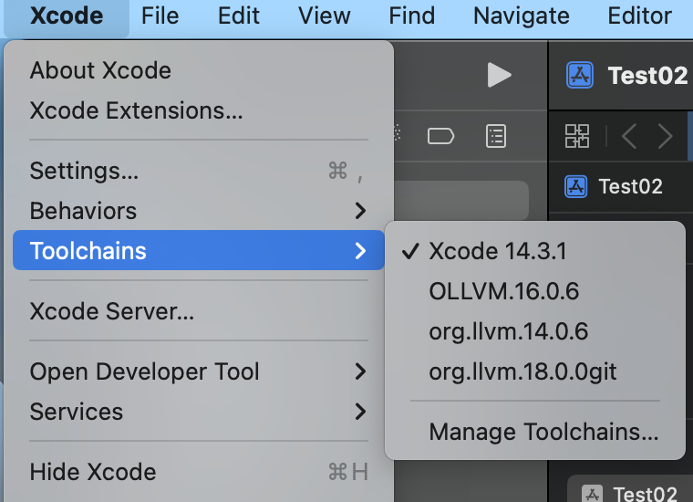

1. 下载必要工具

   ```
   安装 brew
   brew install cmake
   brew install Ninja
   ```

2. 下载LLVM

   ```
   https://github.com/llvm/llvm-project
   ```

3. 下载 Obfuscation 文件

   ```
   
   ```

4. .\llvm-project\llvm\lib\Passes\PassBuilder.cpp

   ```
   // 引用 Obfuscation 相关文件
   #include "Obfuscation/BogusControlFlow.h" // 虚假控制流
   #include "Obfuscation/Flattening.h"  // 控制流平坦化
   #include "Obfuscation/SplitBasicBlock.h" // 基本块分割
   #include "Obfuscation/Substitution.h" // 指令替换
   #include "Obfuscation/StringEncryption.h" // 字符串加密
   #include "Obfuscation/IndirectGlobalVariable.h" // 间接全局变量
   #include "Obfuscation/IndirectBranch.h" // 间接跳转
   #include "Obfuscation/IndirectCall.h" // 间接调用
   
   // 添加命令行支持
   static cl::opt<bool> s_obf_split("split", cl::init(false), cl::desc("SplitBasicBlock: split_num=3(init)"));
   static cl::opt<bool> s_obf_sobf("sobf", cl::init(false), cl::desc("String Obfuscation"));
   static cl::opt<bool> s_obf_fla("fla", cl::init(false), cl::desc("Flattening"));
   static cl::opt<bool> s_obf_sub("sub", cl::init(false), cl::desc("Substitution: sub_loop"));
   static cl::opt<bool> s_obf_bcf("bcf", cl::init(false), cl::desc("BogusControlFlow: application number -bcf_loop=x must be x > 0"));
   static cl::opt<bool> s_obf_ibr("ibr", cl::init(false), cl::desc("Indirect Branch"));
   static cl::opt<bool> s_obf_igv("igv", cl::init(false), cl::desc("Indirect Global Variable"));
   static cl::opt<bool> s_obf_icall("icall", cl::init(false), cl::desc("Indirect Call"));
   
   // 在此函数内直接注册Pipeline回调
   PassBuilder::PassBuilder(...) {
   ...
     this->registerPipelineStartEPCallback(
         [](llvm::ModulePassManager &MPM,
            llvm::OptimizationLevel Level) {
           outs() << "[Soule] run.PipelineStartEPCallback\n";
           MPM.addPass(StringEncryptionPass(s_obf_sobf));
           llvm::FunctionPassManager FPM;
           FPM.addPass(IndirectCallPass(s_obf_icall));
           FPM.addPass(SplitBasicBlockPass(s_obf_split));
           FPM.addPass(FlatteningPass(s_obf_fla));
           FPM.addPass(SubstitutionPass(s_obf_sub));
           FPM.addPass(BogusControlFlowPass(s_obf_bcf));
           MPM.addPass(createModuleToFunctionPassAdaptor(std::move(FPM)));
           MPM.addPass(IndirectBranchPass(s_obf_ibr));
           MPM.addPass(IndirectGlobalVariablePass(s_obf_igv));
         }
     );
   }
   ```

5. ...\llvm-project\llvm\lib\Passes\CMakeLists.txt

   ```
   # 添加 Obfuscation 相关源码
   add_llvm_component_library(LLVMPasses
   ...
   Obfuscation/Utils.cpp
   Obfuscation/CryptoUtils.cpp
   Obfuscation/ObfuscationOptions.cpp
   Obfuscation/BogusControlFlow.cpp
   Obfuscation/IPObfuscationContext.cpp
   Obfuscation/Flattening.cpp
   Obfuscation/StringEncryption.cpp
   Obfuscation/SplitBasicBlock.cpp
   Obfuscation/Substitution.cpp
   Obfuscation/IndirectBranch.cpp
   Obfuscation/IndirectCall.cpp
   Obfuscation/IndirectGlobalVariable.cpp
   ...
   )
   ```

6. 在下载的llvm-project 同级目录创建llvm-build然后在命令行

   ```
   cd llvm-build
   cmake -G Ninja ../llvm-project-llvmorg-16.0.6/llvm -DCMAKE_BUILD_TYPE=Release -DLLVM_CREATE_XCODE_TOOLCHAIN=ON  -DLLVM_ENABLE_PROJECTS="clang" -DCMAKE_INSTALL_PREFIX=~/Library/Developer/
   ninja && ninja install-xcode-toolchain
   ```


7. 完整后的效果

   