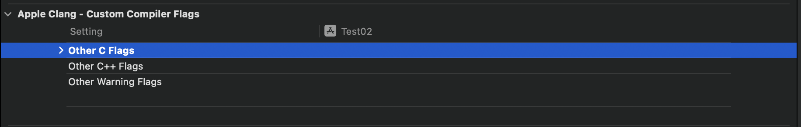
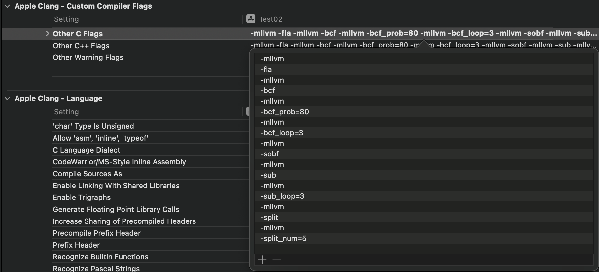

```
- bcf # 虚假控制流
-   bcf_prob # 虚假控制流混淆概率 1~100, 默认70
-   bcf_loop # 虚假控制流重复次数, 无限制, 默认2
- fla # 控制流平坦化
- sub # 指令替换(add/and/sub/or/xor)
- sobf # 字符串混淆(仅窄字符)
- split # 基本块分割
-   split_num # 将原基本块分割数量, 无限制, 默认3

目前报错 ------>
- ibr # 间接分支
- icall # 间接调用 (call 寄存器)
- igv # 间接全局变量
```



```
Other C Flags
-mllvm -fla -mllvm -bcf -mllvm -bcf_prob=80 -mllvm -bcf_loop=3 -mllvm -sobf -mllvm -sub -mllvm -sub_loop=3 -mllvm -split -mllvm -split_num=5
```

