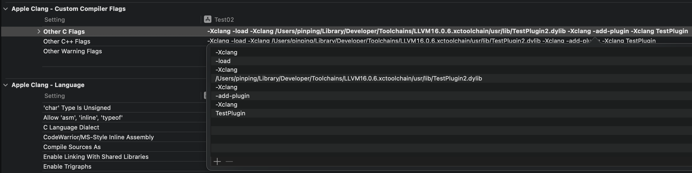

把本项目里面 /LLVM/clang/tools里面的文件 复制到下载 llvm-project 里面 /LLVM/clang/tools 路径下

```
重新执行
ninja && ninja install-xcode-toolchain
```

去 /Users/pinping/Library/Developer/Toolchains 找到编译的 xctoolchain 

找到 /usr/lib/xxxxxxxxx.dylib


```
Other C Flags
-Xclang -load -Xclang /Users/pinping/Library/Developer/Toolchains/LLVM16.0.6.xctoolchain/usr/lib/TestPlugin1.dylib -Xclang -add-plugin -Xclang TestPlugin
```


