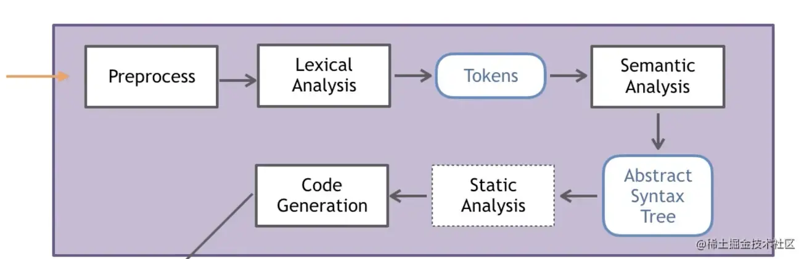

## 1.什么是Clang？

- `Clang` 是 LLVM项目的一个子项目
- `Clang` 是 基于LLVM架构的C/C++/Objective-C编译器前端
- `Clang`官网：[clang.llvm.org/get_started…](https://link.juejin.cn/?target=http%3A%2F%2Fclang.llvm.org%2Fget_started.html)
- 苹果开发平台Xcode之前的编译器前端是gcc后来被替换成了Clang
- 相比于GCC，Clang具有如下优点:
  - **`编译速度快`**：在某些平台上，Clang的编译速度显著的快过GCC（Debug模式下编译OC速度比GGC快3倍）
  - **`占用内存小`**：Clang生成的AST所占用的内存是GCC的五分之一左右
  - **`模块化设计`**：Clang采用基于库的模块化设计，易于 IDE 集成及其他用途的重用
  - **`诊断信息可读性强`**：在编译过程中，Clang 创建并保留了大量详细的元数据 (metadata)，有利于调试和错误报告
  - `设计清晰简单`，`容易理解`，`易于扩展增强`

## 2.`Clang`与 `LLVM`的关系

 

- `广义的LLVM`:整个LLVM架构(包括编译器前端(如Clang)、优化器、编译器后端)
- `狭义的LLVM`:LLVM编译器后端（代码优化、目标代码生成等）

## 3.`Clang` 工作的主要流程



- `预处理（Pre-process）`：include 扩展、标记化处理、去除注释、条件编译、宏删除、宏替换。 对`C`输出`.i`, 对`C++`输出 `.ii`, 对 OC 输出 `.mi`, 对`Objective-C++ `输出 `.mii`；
- `词法分析 （Lexical Analysis）`：将代码切成一个个 token，比如大小括号，等于号还有字符串等。是计算机科学中将字符序列转换为标记序列的过程；
- `语法分析（Semantic Analysis）`：验证语法是否正确，然后将所有节点组成抽象语法树 AST 。由 Clang 中 Parser 和 Sema 配合完成；
- `静态分析（Static Analysis）`：使用它来表示用于分析源代码以便自动发现错误；
- `中间代码生成（Code Generation）`：开始 IR 中间代码的生成了，CodeGen 会负责将语法树自顶向下遍历逐步翻译成 LLVM IR。

## 4.`Clang`命令行指令

```shell
shell
复制代码// 假设原始文件为main.m

// 预编译命令
clang -E main.m -o main.mi

// 生成AST语法树
clang -Xclang -ast-dump -fsyntax-only main.m

// 生成IR中间代码
clang -S -emit-llvm main.m -o main.ll

// 生成IR中间代码并优化，
clang -o3 -S -emit-llvm main.m -o main.ll

// 如果开启bitcode，生成.bc文件，这也是中间码的一种形式
clang -emit-llvm -c main.m -o main.bc

// 产生汇编命令
clang -S main.m -o main.s

// 生成目标.o文件
clang -c main.m -o main.o
```

