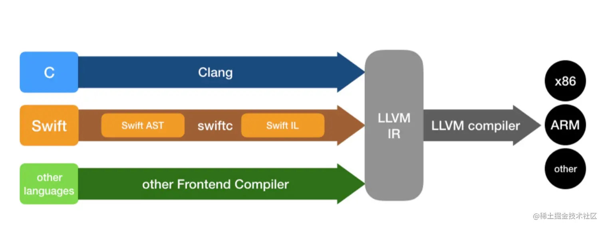

## 1.什么是 `SwiftC`?



- SwiftC 是 Swift 语言的编译器前端

## 2. `SwiftC`与 `LLVM`的关系


- `SwiftC` 作为 Swift语言的编译器前端,最终输出中间代码: LLVM-IR ,提供给编译器后端使用
- `LLVM` 作为 编译器后端,输出指定硬件架构环境的 可执行文件(软件包)

## 3.`SwiftC`的主要工作流程

 

- `Parse`: 词法分析组件，生成 AST语法树；
- `Sema（Semantic Analysis）`：对 AST语法树 进行类型检查，转换为格式正确且类型检查完备的 AST；
- `Clang Importer`: 负责导入 Clang 模块，并将导出的 C 或 Objective-C API 映射到相应的 Swift API 中。最终导入的 AST 可以被语义分析引用。(因为iOS Native环境下 支持Swift、OC、C、CPP混编)
- `SIL Gen`：由 AST 生成 Raw SIL（原生 SIL，代码量很大，不会进行类型检查）；
- `SIL 保证转换`：SIL 保证转换阶段负责执行额外且影响程序正确性的数据流诊断，转换后的最终结果是规范的 SIL；
- `SIL 优化`：该阶段负责对程序执行额外的高级且专用于 Swift 的优化，包括（例如）自动引用计数优化、去虚拟化、以及通用的专业化；
- Swift 编译过程引入 SIL 有几个优点：
  - 完成的变数程序的语义(Fully represents program semantics );
  - 既能进行代码的生成，又能进行代码分析(Designed for both code generation and analysis );
  - 处在编译管线的主通道(Sits on the hot path of the compiler pipeline );
  - 架起桥梁连接源码与 LLVM，减少源码与 LLVM 之间的抽象鸿沟(Bridges the abstraction gap between source and LLVM)

1. `Swift Code` ： 开发者自己编写的代码
2. `Swift AST` ： 根据swiftc生成语法树
3. `Raw Swift IL` ： Swift特有的中间代码
4. `Canonical Swift IL` ： 更加简洁的中间代码版本
5. `LLVM IR` ： 编译器前端处理完后转交给LLVM生成后端中间代码
6. `Assembly` ： 后端对代码进行优化转变成汇编代码
7. `Executable` ： 汇编代码转换成可执行的二进制代码

## 4. `SwiftC` 命令行指令

```shell
shell
复制代码// 假设原始文件为main.swift

// 分析输出AST
swiftc main.swift -dump-parse

// 分析并且检查类型输出AST
swiftc main.swift -dump-ast

// 生成中间体语言（SIL），未优化
swiftc main.swift -emit-silgen -o main.sil 

// 生成中间体语言（SIL），优化后的
swiftc main.swift -emit-sil -o main.sil 

// 生成优化后的中间体语言（SIL）,并将结果导入到main.sil文件中
swiftc main.swift -emit-sil  -o main.sil 

// 生成优化后的中间体语言（SIL），并将sil文件中的乱码字符串进行还原，并将结果导入到main.sil文件中
swiftc main.swift -emit-sil | xcrun swift-demangle > main.sil

// 生成LLVM中间体语言 （.ll文件）
swiftc main.swift -emit-ir  -o main.ir

// 生成LLVM中间体语言 （.bc文件）
swiftc main.swift -emit-bc -o main.bc

// 生成汇编
swiftc main.swift -emit-assembly -o main.s

// 编译生成可执行.out文件
swiftc main.swift -o main.o 
 
```

