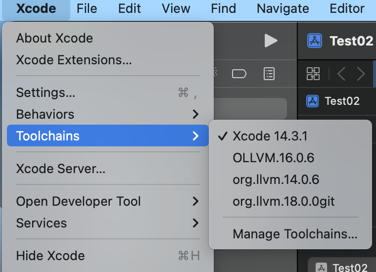

1. 下载必要工具

   ```
   安装 brew
   brew install cmake
   brew install Ninja
   ```

2. 下载LLVM

   ```
   https://github.com/llvm/llvm-project
   ```

3. 下载 Obfuscation 文件

   ```
   
   ```

4. .\llvm-project\llvm\lib\Passes\PassBuilder.cpp

   ```
   // 引用 Obfuscation 相关文件
   #include "Obfuscation/BogusControlFlow.h" // 虚假控制流
   #include "Obfuscation/Flattening.h"  // 控制流平坦化
   #include "Obfuscation/SplitBasicBlock.h" // 基本块分割
   #include "Obfuscation/Substitution.h" // 指令替换
   #include "Obfuscation/StringEncryption.h" // 字符串加密
   #include "Obfuscation/IndirectGlobalVariable.h" // 间接全局变量
   #include "Obfuscation/IndirectBranch.h" // 间接跳转
   #include "Obfuscation/IndirectCall.h" // 间接调用
   
   #include "Obfuscation/SymbolObfuscation.h" //符号混淆
   
   // 添加命令行支持
   static cl::opt<bool> s_obf_split("split", cl::init(false), cl::desc("SplitBasicBlock: split_num=3(init)"));
   static cl::opt<bool> s_obf_sobf("sobf", cl::init(false), cl::desc("String Obfuscation"));
   static cl::opt<bool> s_obf_fla("fla", cl::init(false), cl::desc("Flattening"));
   static cl::opt<bool> s_obf_sub("sub", cl::init(false), cl::desc("Substitution: sub_loop"));
   static cl::opt<bool> s_obf_bcf("bcf", cl::init(false), cl::desc("BogusControlFlow: application number -bcf_loop=x must be x > 0"));
   static cl::opt<bool> s_obf_ibr("ibr", cl::init(false), cl::desc("Indirect Branch"));
   static cl::opt<bool> s_obf_igv("igv", cl::init(false), cl::desc("Indirect Global Variable"));
   static cl::opt<bool> s_obf_icall("icall", cl::init(false), cl::desc("Indirect Call"));
   
   // 在此函数内直接注册Pipeline回调
   PassBuilder::PassBuilder(...) {
   ...
     this->registerPipelineStartEPCallback(
         [](llvm::ModulePassManager &MPM,
            llvm::OptimizationLevel Level) {
           outs() << "[Soule] run.PipelineStartEPCallback\n";
           MPM.addPass(StringEncryptionPass(s_obf_sobf));
           llvm::FunctionPassManager FPM;
           FPM.addPass(IndirectCallPass(s_obf_icall));
           FPM.addPass(SplitBasicBlockPass(s_obf_split));
           FPM.addPass(FlatteningPass(s_obf_fla));
           FPM.addPass(SubstitutionPass(s_obf_sub));
           FPM.addPass(BogusControlFlowPass(s_obf_bcf));
           MPM.addPass(createModuleToFunctionPassAdaptor(std::move(FPM)));
           MPM.addPass(IndirectBranchPass(s_obf_ibr));
           MPM.addPass(IndirectGlobalVariablePass(s_obf_igv));
         }
     );
   }
   ```

5. ...\llvm-project\llvm\lib\Passes\CMakeLists.txt

   ```
   # 添加 Obfuscation 相关源码
   add_llvm_component_library(LLVMPasses
   ...
   Obfuscation/Utils.cpp
   Obfuscation/CryptoUtils.cpp
   Obfuscation/ObfuscationOptions.cpp
   Obfuscation/BogusControlFlow.cpp
   Obfuscation/IPObfuscationContext.cpp
   Obfuscation/Flattening.cpp
   Obfuscation/StringEncryption.cpp
   Obfuscation/SplitBasicBlock.cpp
   Obfuscation/Substitution.cpp
   Obfuscation/IndirectBranch.cpp
   Obfuscation/IndirectCall.cpp
   Obfuscation/IndirectGlobalVariable.cpp
   ...
   )
   ```

6. 在下载的llvm-project 同级目录创建llvm-build然后在命令行

   ```
   cd llvm-build
   cmake -G Ninja ../llvm-project-llvmorg-16.0.6/llvm -DCMAKE_BUILD_TYPE=Release -DLLVM_CREATE_XCODE_TOOLCHAIN=ON  -DLLVM_ENABLE_PROJECTS="clang" -DCMAKE_INSTALL_PREFIX=~/Library/Developer/
   
   cmake -G Ninja ../llvm-project-llvmorg-16.0.6/llvm -DCMAKE_BUILD_TYPE=Release -DLLVM_CREATE_XCODE_TOOLCHAIN=ON -DLLVM_ENABLE_PROJECTS="clang;clang-tools-extra;lld;lldb" -DLLVM_ENABLE_RUNTIMES="compiler-rt;libcxx;libcxxabi;libunwind" -DCMAKE_INSTALL_PREFIX=~/Library/Developer/
   
   
   ninja && ninja install-xcode-toolchain
   ```

​	

- 常见的 generator:

```
Ninja : 用于生产Ninja配置文件，大多数的LLVM开发之使用Ninja。
Unix Makefiles : 用于生成兼容make的并行makefile
Visual Studio : 用于生成Visual Studio项目和解决方案
Xcode :用于生成Xcode项目
```

- DCMAKE_BUILD_TYPE

```
Debug
由于没有优化和完整的调试信息，这通常在开发和调试期间使用，因为它通常提供最快的构建时间和最佳的交互式调试体验。

Release
这种构建类型通常快速的提供了充分的优化，并且没有调试信息，尽管一些平台在某些情况下仍然可能生成调试符号。它通常是为最终产品版本构建软件时使用的构建类型。

RelWithDebInfo
这在某种程度上是前两者的折衷。它的目标是使性能接近于发布版本，但仍然允许一定程度的调试。通常应用大多数速度优化，但也启用了大多数调试功能。因此，当调试构建的性能甚至对调试会话来说都是不可接受的时，这种构建类型最有用。请注意，RelWithDebInfo的默认设置将禁用断言。

MinSizeRel
这种构建类型通常只用于受限制的资源环境，如嵌入式设备。代码是针对大小而不是速度进行优化的，并且没有创建调试信息。每种构建类型都会产生一组不同的编译器和链接器标志。它还可能改变其他行为，比如改变编译的源文件或链接到的库。
```

- DLLVM_CREATE_XCODE_TOOLCHAIN

```

```

- DLLVM_ENABLE_PROJECTS

```
clang：编译器前端，以及一些相关的编译器前端工具集；
clang-tools-extra：额外的clang工具，如：clangd，clang-format等；
lld：LLVM的链接器，链接速度贼快，LLVM+CLANG工具集必选；
lldb：LLVM项目的调试器，作用和GDB一样；
```

- DLLVM_ENABLE_RUNTIMES

````
compiler-rt：LLVM后端的编译器运行时库；
libcxx：作为libstdc++的替代，LLVM后端的C++运行时库；
libcxxabi：LLVM后端的C++二级制接口运行时库；
----------
libc：LLVM后端的libc运行时库；
libunwind：LLVM后端的栈回滚库，主要是用于获取程序的调用栈和异常处理和跳转需要；
````


7. 完整后的效果

   


编译Xcode

```
cmake -G Xcode -DLLVM_ENABLE_PROJECTS="clang" -DCMAKE_BUILD_TYPE=MinSizeRel -DLLVM_APPEND_VC_REV=on -DLLDB_USE_SYSTEM_DEBUGSERVER=YES -DLLVM_CREATE_XCODE_TOOLCHAIN=on ../llvm-project-llvmorg-16.0.6/llvm


```


```

https://juejin.cn/post/7000886413168214052

```


